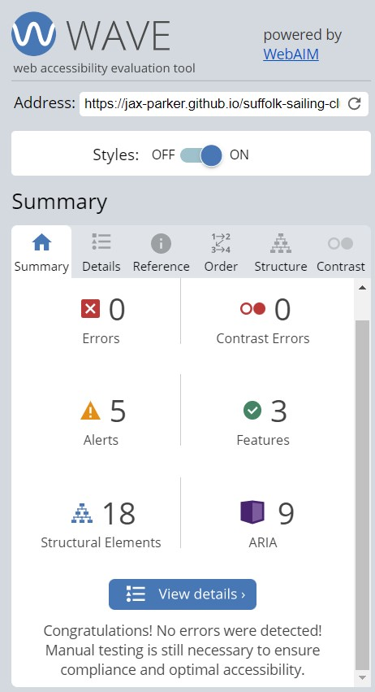
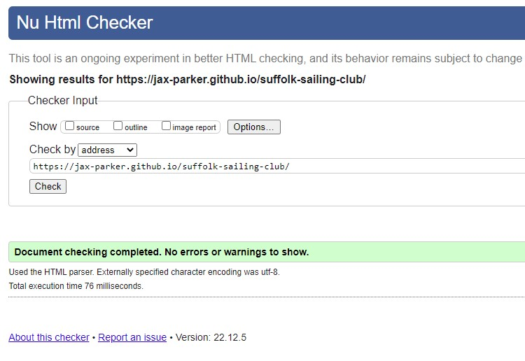

## Table of Contents
* [Purpose](#Purpose)
* [User Experience Design (UX)](#User-Experience-Design)
  * [User stories](#User-Stories)
    * [First Time Visitor Goals](#First-Time-Visitor-Goals)
    * [Returning Visitor Goals](#Returning-Visitor-Goals)
    * [Frequent User Goals](#Frequent-Visitor-Goals)
  * [Structure](#Structure)
  * [Design](#Design)
    * [Colour Scheme](#Colour-Scheme)
    * [Typography](#Typography)
    * [Imagery](#Imagery)
    * [Wireframes](#Wireframes)
    * [Differences to Design](#Differences-to-Design)
    * [Limitations](#Limitations)
    * [Features](#Features)
    * [Existing Features](#Existing-Features)
    * [Future Features](#Features-Left-to-Implement)
* [Technologies](#Technologies)
* [Testing](#Testing)
    * [Test Strategy](#Test-Strategy)
      * [Summary](#Summary)
      * [Validation](#Validation-Test-Cases)
    * [Test Results](#Test-Results)
    * [Testing Issues](#Issues-and-Resolutions-to-issues-found-during-testing)
* [Deployment](#Deployment)
    * [Project Creation](#Project-Creation)
    * [GitHub Pages](#Using-Github-Pages)
* [Credits](#Credits)
  * [Content](#Content)
  * [Media](#Media)
  * [Acknowledgements](#Acknowledgements)
  

# Project 1 Suffolk Sailing Club
## Purpose
This Website was created for the sole purpose of completing the first project for the Code Institute's Full Stack Developer course.
It was built using the knowledge gained from the previous HTML and CSS courses. A full list of technologies used can be found in the technologies section of this document.
The Suffolk Sailing Club website is a fictitious site designed for the owners of a privately owned lake offering membership to a club which provides facilities for small sailing boats, kayaks and paddleboards. The client wants to promote the club to increase membership numbers and provide information to current members regarding lessons, clubs and social activities. The site is targeted at anyone who is interested in amateur water sports who would like to take up or continue with this hobby and also improve their skills via the lessons offered. It is also encouraging members to join the social events as a way to engage with other members of the club.

The live website can be found [here](https://jax-parker.github.io/suffolk-sailing-club/).

## Suffolk Sailing Club Responsive Website

***
## User Experience Design

### User stories
#### First Time Visitor Goals
* As a First Time user, I want to easily understand the main purpose of the site and learn more about the club.
* As a First Time user, I want to be able to easily navigate throughout the site to find content.
* As a First Time user, I want to view the website and content clearly on my mobile device, tablet, desktop or laptop.
* As a First Time user, I want to find ways to follow the Suffolk Sailing Club on different social media platforms.
* As a First Time user, I want to see what activities and social events the club holds.
* As a First Time user, I want to contact the club to apply for membership or ask for more information.
* As a First Time user, I want to be sure my details have been submitted and I will receive a reply.
#### Returning Visitor Goals
* As a Returning user, I want to view the website and content clearly on my mobile device, tablet, desktop or laptop.
* As a Returning user, I want to navigate quickly through pages I have seen before to get to the pages which are updated the most.
* As a Returning user, I want to reread information about the club I may have forgotten or not been sure of.
* As a Returning user, I want to see what clubs, lessons or social events are being organised.
* As a Returning user, I want to contact the club so I can request more information.
* As a Returning user, I want to be sure my details have been submitted and I will receive a reply.
#### Frequent Visitor Goals
* As a Frequent user, I want to check to see if there are any new upcoming events or club activities.
* As a Frequent user, I want to sign up to the clubs, lessons or social events or request more information about them.
* As a Frequent user, I want to be sure my details have been submitted and I will receive a reply.
### Structure
All Pages will contain a Navigation menu at the top of the Webpage that directs them to a new Page to easily allow users to Navigate the site easily.
The Nav Menu will be sticky on all devices to avoid the user having to scroll to the top of the page to navigate somewhere else. It will also be underlined on the active page to remind the user where they are.
The purpose of this is to fulfil user story:
> As a First Time user, I want to be able to easily navigate throughout the site to find content. 
> As a Returning user, I want to navigate quickly through pages I have seen before to get to the pages which are updated the most.

The Home Page will contain a hero image and information about the club. There is a contact us button at the bottom of the page. This page is to help implement the user stories:
> As a First Time user, I want to easily understand the main purpose of the site and learn more about the club. 
> As a First Time user, I want to view the website and content clearly on my mobile device, tablet, desktop or laptop. 
> As a Returning user, I want to reread information about the club I may have forgotten or not been sure of. 
The Home Page will contain small sections of information about the club.

The purpose of this is to fulfil the user stories:
> As a First Time user, I want to easily understand the main purpose of the site and learn more about the club. 
> As a Returning user, I want to reread information about the club I may have forgotten or not been sure of.

The Activities Page will contain information on upcoming events run by the club. There will be a contact us button at the bottom of the page.
The purpose of this is to fulfil user stories:
> As a First Time user, I want to see what activities and social events the club holds. 
> As a Returning user, I want to see what clubs, lessons or social events are being organised. 
> As a Frequent user, I want to check to see if there are any new club activities.

The Contact Us Page will contain a simple form for the user to contact the club.
The purpose of this is to fulfil the user stories:
> As a First Time user, I want to contact the club to apply for membership or ask for more information. 
> As a Returning user, I want to contact the club so I can request more information. 
> As a Frequent user, I want to sign up to the clubs, lessons or social events or request more information about them.

The Thank You Page will contain a thank you message to let the user know the club has received their details and will get back to them.
The purpose of this is to fulfil the user stories:
> As a First Time user, I want to be sure my details have been submitted and I will receive a reply. 
> As a Returning user, I want to be sure my details have been submitted and I will receive a reply. 
> As a Frequent user, I want to be sure my details have been submitted and I will receive a reply.

All pages will contain a Footer Element with a Contact Button (activities page before the video) and Social Media Icons. The icons used will be
from font-awesome. The aim of the Footer elements are to fulfil user stories:
> As a First Time user, I want to find ways to follow the Suffolk Sailing Club on different social media platforms. 
> As a First Time user, I want to contact the club to apply for membership or ask for more information. 
> As a Returning user, I want to contact the club so I can request more information. 
> As a Frequent user, I want to sign up to the clubs, lessons or social events or request more information about them.

All pages will be responsive and the layouts will change dependant on screen size. This is to ensure content flow is appealing,
images are displayed properly and that the content is not shrunk side by side, so small that it is unreadable.
The purpose of this is to fulfil the user stories:
> As a First Time user, I want to view the website and content clearly on my mobile device, tablet, desktop or laptop. 
> As a Returning user, I want to view the website and content clearly on my mobile device, tablet, desktop or laptop.

### Design
#### Colour Scheme
The two main colours used are Dark Blue #152E67 and a Light Blue #3493D0.  These colours were both matched to the club logo using the dropper in Paint. The third shade of blue in the logo, #1A64A4 was used for the hover colour on the Contact Us button. The blue was chosen to represent the subject of the water and give a relaxed feel. 

#### Typography
The headers on all pages throughout the Website are using the **Roboto Condensed** font while the main text is using the **Roboto** font. These were chosen as a complimentary pair using Fontpair (https://www.fontpair.co/all) which recommended them a good match.

#### Imagery
The client wanted the logo to be recognisable on any media site and was keen for it to be in the header for each page and as the favicon on the address tab. The photos were chosen to match the text and either provide visual information about the clubs facilities or to entice new members to the club. Photos were sourced from the following: 

Logo - https://www.hiclipart.com/free-transparent-background-png-clipart-dnupb 
Hero Image - https://pixabay.com/photos/wild-geese-birds-lake-geese-3379677/ 
The Lakes & Membership - Home photos taken on my iPhone 8. 
Facilities - https://pixabay.com/photos/yellow-changing-room-4719246/ 
Storage - https://pixabay.com/photos/boat-shelf-florida-usa-vacations-3746219/ 
Activity Icons - https://fontawesome.com/ 
Favicon - https://favicon.io/ 

#### Wireframes
Home Page 
* [Home Page Wireframe](assets/wireframes/wireframe-home-page.jpg) 
About Page 
* [Activities Page Wireframe](assets/wireframes/wireframe-activities-page.jpg) 
Contact Page 
* [Contact Page Wireframe](assets/wireframes/wireframe-contact-page.jpg) 
Thank You Page 
* [Thank You Page Wireframe](assets/wireframes/wireframe-thankyou-page.jpg) 

# Differences To Design
After comparing the original wireframe designs to the finished website; 
* Home Page
The homepage had a div added with a title for the Club information section to break up the page. The mobile version had to have the title and strapline realigned to fit the screensize. 
* Activities Page
The activities were spread across the whole width of the page with an obscured background to make the club activities 'pop out'. A short intro title was added just before the video to introduce it. 
* Contact Page
On first design, the contact page call to action (the form) was lost so a reverse block background was added the edges softened with radius adjustment.
* Thank you Page
The text had a background added to it to ensure it didn't get lost against the background of the hero image taken from the homepage and the nav bar was removed. Clicking on the title will get you back to the homepage if required. 
* Please see [Here](assets/wireframes/wireframe_vs_website.pdf) for images of differences to design. 

# Limitations
Due to no JavaScript functionality the contact form does not store data.
## Features

### Existing Features
- The website has 3 main pages accessible to the user which include the Homepage, Activities Page and Contact Us Page. There is also a thank you page which only shows on submission of the contact form.
All pages include the following features:
- Logo, Club name and strapline. They show at the top of each page to ensure the user knows they are on the same website and to enforce recognition of the logo and club font/colour.
- Navigation bar. The menu appears on all three pages and allows users to move through the different pages of the website easily as a sticky positioning has been implemented to avoid scrolling back to the top of the page ensuring a good user experience across all pages.
- Footer. The footer contains 4 recognisable icons for social media sites; Facebook, Twitter, YouTube and Instagram. Each one opens on to a new window.

### Features Left to Implement
- Users details could go to a database for members list. 
- Gallery page could be added to show images of past events at the club.
- Add a booking page so members could book lessons, places at social events or club places.
***
## Technologies

* HTML
	* This project uses HTML as the main language used to complete the structure of the Website.
* CSS
	* This project uses custom written CSS to style the Website.
* [Font Awesome](https://fontawesome.com/)
	* Font awesome Icons are used for the Social media links contained in the Footer section of the website and club, lesson & social events on the Activities page.
* [Google Fonts](https://fonts.google.com/)
	* Google fonts are used throughout the project to import the *Roboto Condensed* and *Roboto* fonts.
* [GitHub](https://github.com/)
	* GithHub is the hosting site used to store the source code for the Website and [Git Pages](https://pages.github.com/) is used for the deployment of the live site.
* [Git](https://git-scm.com/)
	* Git is used as version control software to commit and push code to the GitHub repository where the source code is stored.
* [Google Chrome Developer Tools](https://developers.google.com/web/tools/chrome-devtools)
	* Google chromes built in developer tools are used to inspect page elements and help debug issues with the site layout and test different CSS styles.
* [balsamiq Wireframes](https://balsamiq.com/wireframes/)
	* This was used to create wireframes for 'The Skeleton Plane' stage of UX design.
* [MS PAINT](https://support.microsoft.com/en-us/windows/get-microsoft-paint-a6b9578c-ed1c-5b09-0699-4ed8115f9aa9)
    * The dropper tool is this program was used against the Site logo to determine the exact shades of blue to be used.
* [Favicon](https://favicon.io/)
    * Favicon.io was used to make the site favicon
* [UI.Dev](https://ui.dev/amiresponsive)
    * Multi Device Website Mockup Generator was used to create the Mock up image in this README
***
## Testing

### Test Strategy

#### Summary

As this project is static and contains no back-end functionality, the testing performed will be on the visual effects and layout of the Website. Testing to be done on at least three web browsers and all screen sizes.

No elements should overlap another container div.

All nav links should direct to the correct html pages as per their names. The Home page is the exception, this one will redirect to index.html.

All links to external websites (social media sites) must open in a new browser.

Testing of form validation will also be required to ensure the correct inputs are taken, that all fields are required and thank you page appears on submission.

The live Project can be found [here](https://jax-parker.github.io/suffolk-sailing-club/). 
#### Validation Test Cases
To validate web accessibility the webiste was tested on [Wave](https://wave.webaim.org/). No errors were found. Five alerts were shown stating the alt text was not sufficient. This was improved and the test rerun but did not improve the score. 
 

### Validation Testing
All Pages were run through the [W3C HTML Validator](https://validator.w3.org/) and showed no errors. 
 
CSS Stylesheet was run through the [W3C CSS Validator](https://jigsaw.w3.org/css-validator/) and showed no errors. 
Website was tested by running locally and tested on the deployed version. No differences found.
 
Website was run through Google Developer Tools - Lighthouse with the following scores. 
 

### Function Testing
**Validation tests were run as below for user experience. Details of how they were performed along with other validation testing can be found [Here](assets/readme-images/test-report.pdf).** 
Please note this report is a PDF and will require google docs or Acrobat to open. 
The site was also tested at  which shows the site portrait and landscape on different types of platforms.

* As a First Time user, I want to easily understand the main purpose of the site and learn more about the club:
* As a Returning user, I want to reread information about the club I may have forgotten or not been sure of:
- **Testing was performed to ensure Club information was displayed on the Home Page. - Successful** 

* As a First Time user, I want to be able to easily navigate throughout the site to find content:
* As a Returning user, I want to navigate quickly through pages I have seen before to get to the pages which are updated the most:
- **Testing was performed on all Navigation links to ensure users can easily navigate the Website. - Successful**

* As a First Time user, I want to view the website and content clearly on my mobile device, tablet, desktop or laptop:
* As a Returning user, I want to view the website and content clearly on my mobile device, tablet, desktop or laptop:
- **Testing was performed to ensure the Website was responsive on all devices. - Successful**

* As a First Time user, I want to find ways to follow the Suffolk Sailing Club on different social media platforms:
- **Testing was performed to ensure Social Media links had been added to the footer of each page and when clicked on, opened in a new window. - Successful**

* As a First Time user, I want to see what activities and social events the club holds:
* As a Returning user, I want to see what clubs, lessons or social events are being organised:
* As a Frequent user, I want to check to see if there are any new upcoming events or club activities:
- **Testing was performed to ensure the Activities page clearly showed each activity, was easily readable and the video played correctly and the contact us button redirected to the form. - Successful**

* As a First Time user, I want to contact the club to apply for membership or ask for more information:
* As a Returning user, I want to contact the organisation so I can request more information:
* As a Frequent user, I want to sign up to the clubs, lessons or social events or request more information about them:
- **Testing was performed to ensure that all Contact Us buttons were functioning correctly, that all form inputs were required and the submission form directed to the thank you page. - Successful**

* As a First Time user, I want to be sure my details have been submitted and I will receive a reply:
* As a Returning user, I want to be sure my details have been submitted and I will receive a reply:
* As a Frequent user, I want to be sure my details have been submitted and I will receive a reply:
- **Testing was done to ensure the thank you page was clear and stated a reply will be soon. - Successful**

### Issues and Resolutions to issues found during testing
* Clicking the logo doesn't redirect to home page. This was resolved by updating the href on all Pages.
* Responsiveness on medium size screen was misaligned. This was resolved by adding css styling to the Medium Screens section.
* Video on Activities page was not showing on live website. This was resolved by removing a backslash from the source address.
* Hero image disappeared from screen on homepage. This was resolved by adding background-size:cover and positioning to center.
* Flex boxes on Homepage would not align properly. This was resolved by more studying of flex boxes, how they worked and playing the Zombie Flex game.
* Spelling mistakes were found when proof reading, these were corrected.
* Background on Activities page was overpowering the text. This was fixed by increasing the opacity to 0.8.
* Contact form section was getting lost by other divs overpowering colour. This was fixed by changing colors so the form stood out more.
* Contact form was not bold enough. This was resolved by adding css styling to the form to ensure it was properly visible.
* Thank you page text was not showing properly on smaller screens. This was resolved by by adding css styling and a translucent background on smaller screens.
* Logo alignment. The boat was sitting lower than the title and looked incorrect. This was resolved by css styling on all media sizes.
* Added a lower media of 320px and adjusted the CSS to accomodate smaller mobile screens.
* The'required' in the input line for my form on the contacts page would not work as the info required alert did not show up and redirection worked on clicking the submit button. I sought help on Stack Overflow and Slack.[Stack Overflow Answer](assets/readme-images/stack-overflow-answer.jpg). This was not the case though and I found the answer by returning to the Love Running Project in the course and discovering that the type of the button had to be submit. 
***
## Deployment

### Project Creation
The project was started by opening my Github profile page, clicking on repositories and new. I chose the Code-Institute-Org/gitpod-full-template from my template drop down box and named my repository Suffolk-Sailing-Club. I checked the Public radio button and create repository. I clicked on the new repository, then clicked gitpod to open in a new workspace.

The following commands were used throughout the project:

* git add - Was used to add changes to the local repository.
* git commit -m *commit message explaining the updates* - This command was used to commit changes to the local repository.
* git push - This command is used to push all commited changes to the GitHub repository.

**Git Commit Note** - to begin with my commits were all over the place and did not have any structure with more deletions than insertions but as my project progressed my commits became structured and more consise.

### Using Github Pages
1. Navigate to the GitHub [Repository:](https://github.com/jax-parker/suffolk-sailing-club)
1. Click the 'Settings' Tab.
1. Click on 'Pages.
1. Select 'Main' as the branch.
1. Click the Save button.
1. Click on the link to go to the live deployed page. [Live Page:](https://jax-parker.github.io/suffolk-sailing-club/)

***
## Credits
### Code
The html and css code was learned from the Code Institute Full Stack Software Developer Course.
### Content
The content of this software was created by Jakki Parker.

### Media
The photos and video used in this video are property of Jakki Parker or under free license from the websites stated.
The kayaking video on the activities page is under free license from the website stated.

### Acknowledgements

I'd like to thank my mentor Ronan McClelland for his guidance throughout my project. 
Thanks to family and friends who tested the site on iPhones, Samsungs, desktops and tablets. 
